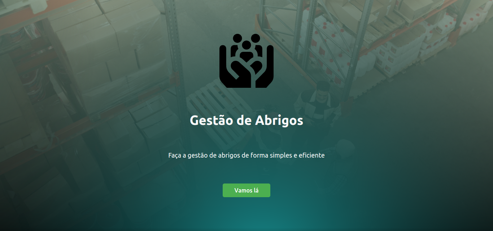
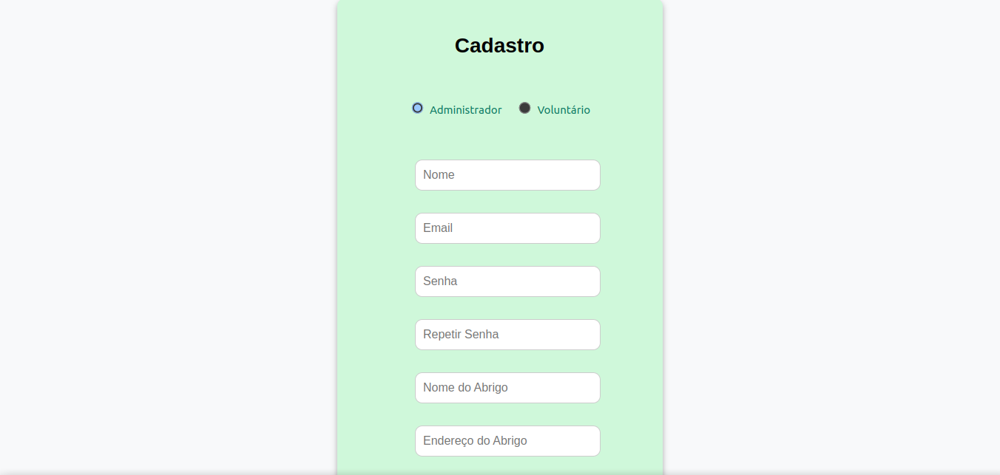
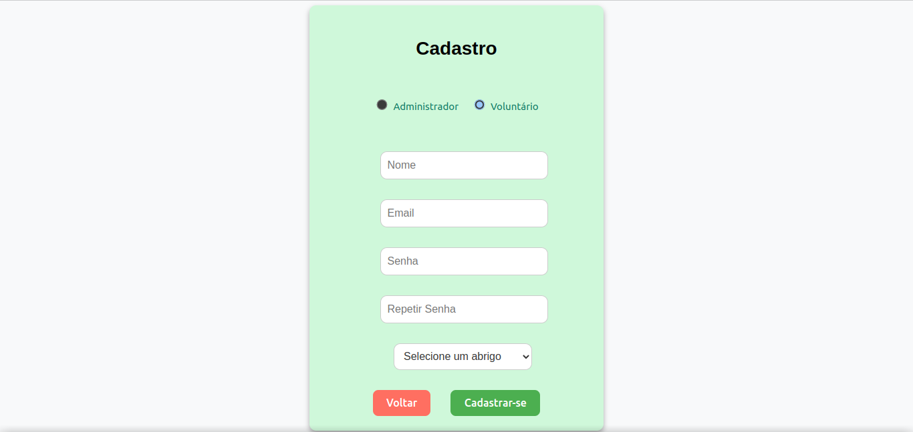
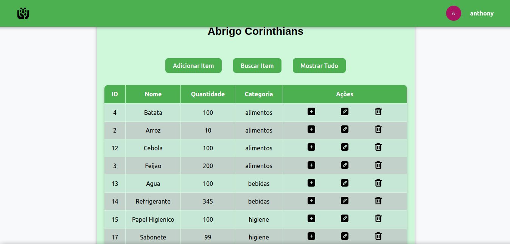
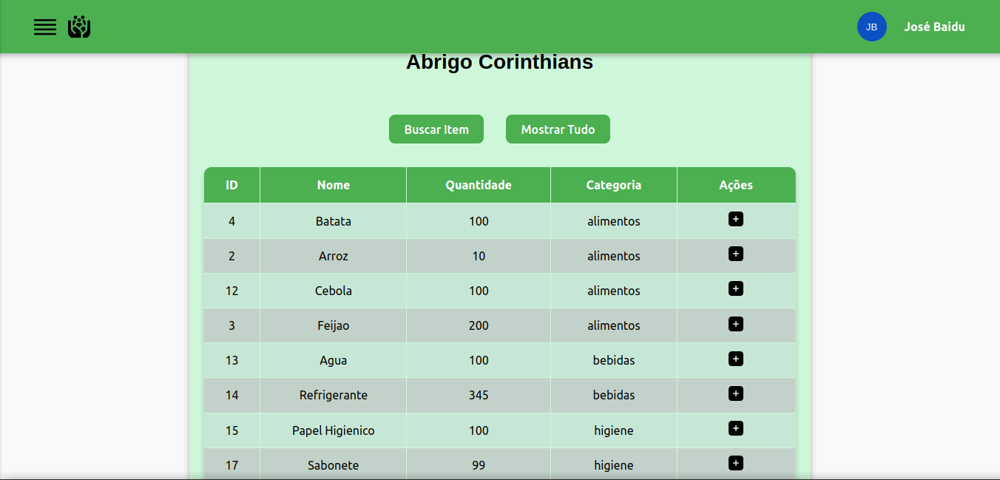

# Controle de Estoque para Abrigos

Este projeto visa desenvolver um sistema para gerenciar o estoque de abrigos, permitindo que administradores e voluntarios possam realizar consultas, acréscimos e decréscimos no estoque.

### Deploy: 
https://endearing-starship-fe8800.netlify.app/

#### Tela Inicial


### Sobre o sistema:

#### Permissões de administrador:

- Cadastro de `administrador` que durante o processo cria o abrigo que irá administrar;
- O `admnistrador` pode adicionar, excluir, editar os dados do item (funções exclusivas) e também incrementar e decrementar a quantidade dos mesmos;
- Pode realizar buscas para filtrar as informações desejadas clicando no botão `Buscar Item`, para ver toda a tabela novamente, basta um clique no botão `Mostrar Tudo`;
- Outra ação que o `administrador` pode realizar é a exclusão do abrigo que foi criado durante o cadastro;
- O `administrador` pode fazer login e se deslogar clicando no seu nome e na sequência clicando na opção ```Sair```;

#### Permissões de voluntário:

- Cadastro de `voluntario` que durante este processo seleciona um abrigo existente para ser voluntário;
- O `voluntario` pode incrementar e decrementar a quantidade de itens existentes no abrigo;
- Pode realizar buscas para filtrar as informações desejadas clicando no botão `Buscar Item`, para ver toda a tabela novamente, basta um clique no botão `Mostrar Tudo`;
- É possível fazer login e se deslogar clicando no seu nome e na sequência clicando na opção ```Sair```;

#### Para utilizar um abrigo já existente com vários itens já cadastrados:
  
  - **Administrador**:
    - Login: `anthony@gmail.com`
    - Senha: `1234`
  
  - **Voluntário**:
    - Login: `baidu@gmail.com`
    - Senha: `1234Abcd!`

#### Tela de Login


#### Tela de cadastro de administrador


#### Tela de cadastro de voluntario


#### Tela de dashboard de admin


#### Tela de dashboard de voluntario


## Documentação

- [`Documento de Visão`](./docs/Visao.md)
- [`Documento de Requisitos`](./docs/Requisitos.md)
- [`Diagrama Entidade Relacionamento`](https://github.com/elc1090/project3-2024a-anthony-luizfelipe/blob/main/docs/Diagrama_Entidade_Relacionamento.md?plain=1)

## Estrutura do Projeto

- [`frontend/`](frontend/): Código fonte do front-end (React).
- [`backend/`](backend/): Código fonte do back-end (Express.js).
- [`database/`](database/): Scripts e configurações do banco de dados (PostgreSQL).

## Tecnologias Utilizadas

- **Front-end**: React
- **Back-end**: Node.js
- **Banco de Dados**: PostgreSQL
- **ORM (Object-Relational Mapping)**: Prisma 
- **Hospedagem do Back-end**: Render
- **Hospedagem do Front-end**: Netlify
- **Hospedagem do Banco de Dados**: Render

## Como Contribuir

1. Faça um fork deste repositório.
2. Crie uma branch para sua feature ou correção (`git checkout -b feature/nome-da-feature`).
3. Faça commit das suas alterações (`git commit -m 'Adicionei uma nova feature'`).
4. Faça push para a branch (`git push origin feature/nome-da-feature`).
5. Abra um Pull Request.

## Criadores

- [Anthony Carlos da Silva](https://github.com/anthony-c-silva)
- [Luiz Felipe Cavalheiro](https://github.com/luizfelipecavalheiro)
  
